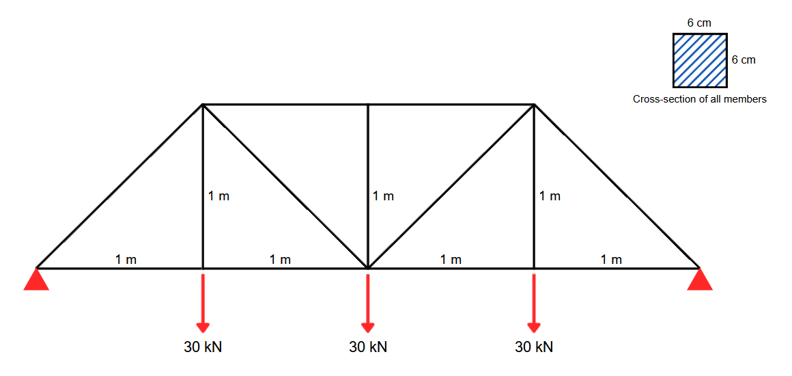
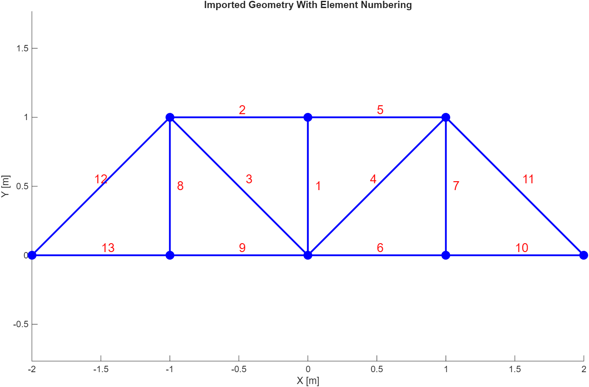
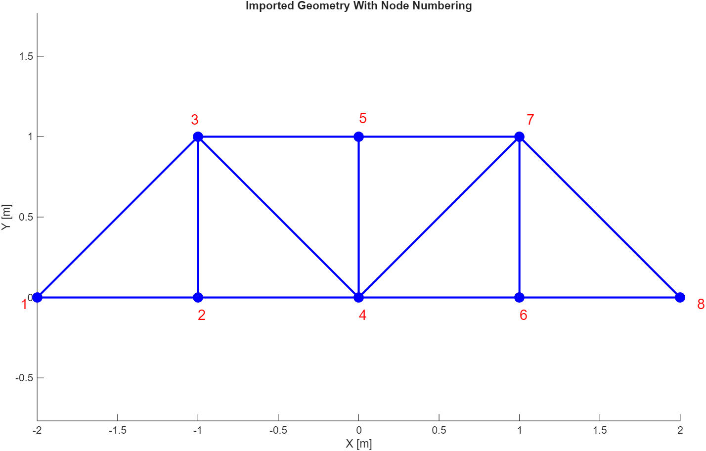
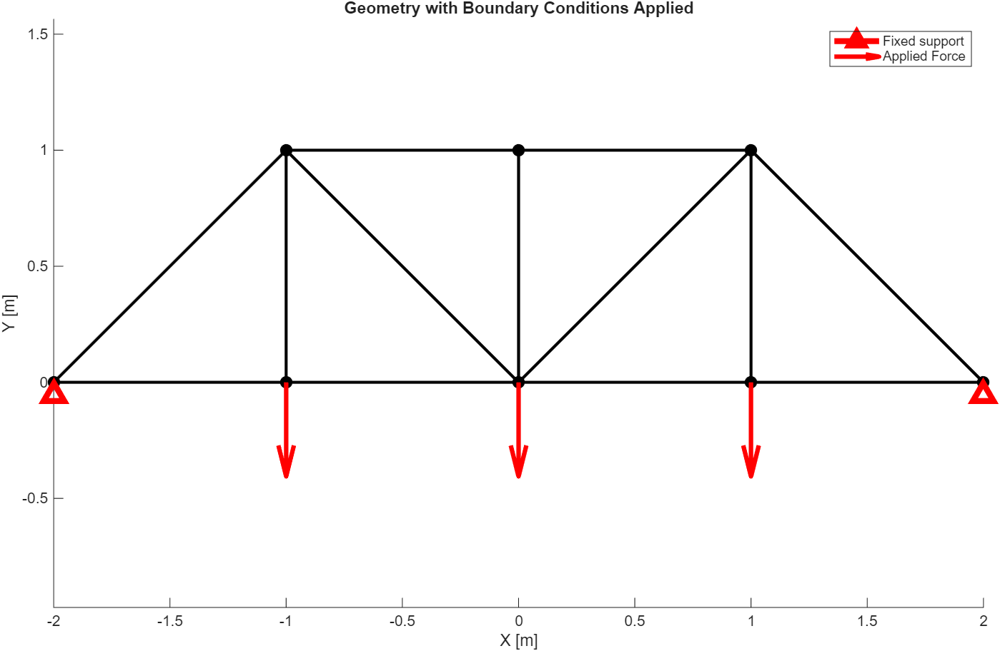
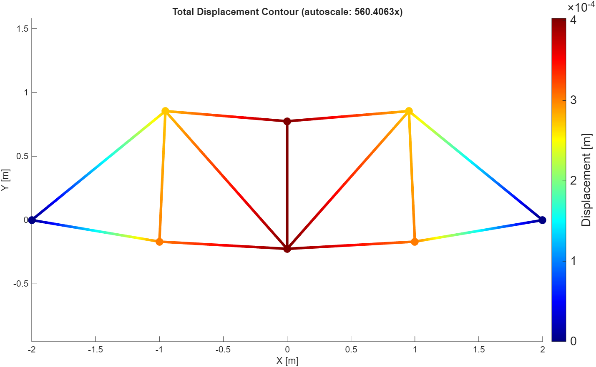
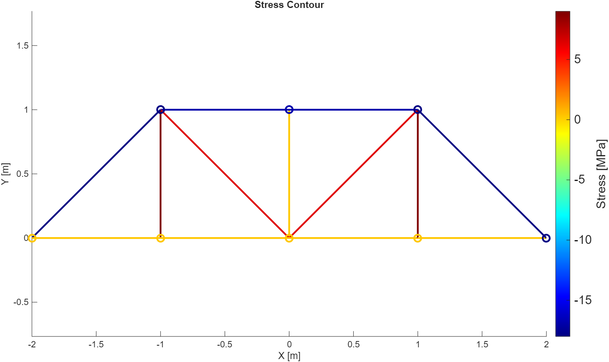
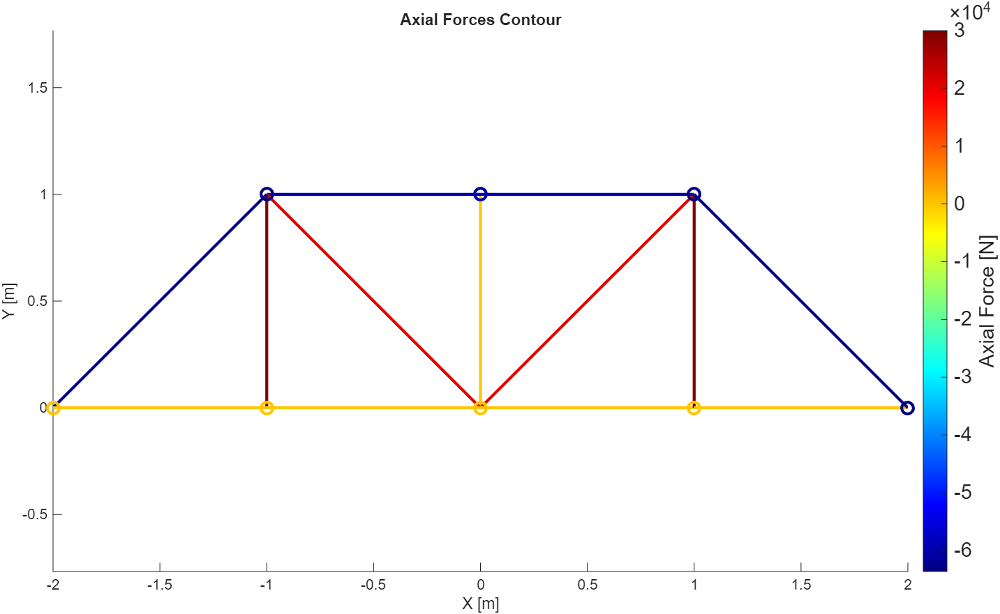
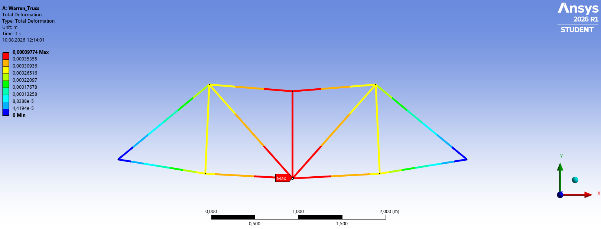

# Warren Truss — Example & Validation

## 1. Overview

This example demonstrates the complete workflow of the 2D Truss
Solver developed as part of the Structural Analysis Toolkit.

The truss geometry was created in a CAD environment and exported
as a DXF file. The DXF file is then imported into MATLAB, where
the geometry is processed automatically and analyzed using the
finite element method.

The MATLAB results are validated against an analysis
performed using ANSYS Mechanical Student Version.

---

## 2. Problem Definition

The problem consists of a planar Warren truss subjected to the
following external loading and boundary conditions.



*Figure 1. Warren truss geometry, applied loads, and boundary conditions.*

### Material Properties

| Property | Value |
|---|---:|
| Young's Modulus | 200 GPa |
| Cross-sectional Area | 0.0036 m² |

### Analysis Assumptions

- 2D truss formulation
- Linear elastic material behavior
- Small displacements
- Constant cross-sectional area
- Axial deformation only
- Each truss member is represented by a single finite element

---

## 3. CAD Geometry

The truss geometry was created in Autodesk Inventor and exported
as a DXF file.

The DXF file is then imported using the custom DXF
parser implemented in the solver.

The input DXF filename, material Young's modulus, and cross-sectional 
area are currently defined directly in the main MATLAB script:

```matlab
E= 2e+11; % Young's Modulus in Pascal
Area=  0.06*0.06; % Area in meter^2

%Reading .dxf file
truss_member_array = DXF_parser_truss('Warren_Truss.dxf', unit_convert);
```

The parser extracts the coordinates of the truss members from the
DXF file and stores them in ```truss_member_array```.

After the geometry is imported, the solver automatically performs
node identification, connectivity generation, and global stiffness
matrix assembly.

No additional user input is required during this stage.

### Unit Conversion

The DXF geometry is converted to the analysis unit system using
the ```unit_convert``` parameter.

It should be noted that only CAD drawings in mm are supported; therefore, 
the ```unit_convert``` parameter is currently hardcoded.



*Figure 2. Imported truss geometry with element numbering.*



*Figure 3. Imported truss geometry with node numbering.*

---

## 4. Boundary Conditions and Applied Loads

The boundary conditions and external loads are defined through
the MATLAB Command Window while using **Figure 3** for node numbering reference.

The resulting model configuration is shown below.



*Figure 4. Applied boundary conditions and external loads.*

### Boundary Conditions

| Node | Support Type |
|---:|---|
| 1 | Fixed |
| 8 | Fixed |

### Applied Loads

| Node | Fx (N) | Fy (N) |
|---:|---:|---:|
| 2 | 0 | -30000 |
| 4 | 0 | -30000 |
| 6 | 0 | -30000 |

---

## 5. MATLAB Solver Results

The solver is then analyzes the truss and generates the resulting 
figures and tables.

### Deformed Shape



*Figure 5. Deformed truss configuration.*

### Stress Distribution



*Figure 6. Element stress distribution.*

### Axial Force Distribution



*Figure 7. Axial force distribution.*

### Element Results

| Element No. | Axial Force (N) | Stress (MPa) | Strain |
|---:|---:|---:|---:|
| 1 | 0 | 0 | 0 |
| 2 | -60000 | -16.667 | -8.3333e-05 |
| 3 | 21213 | 5.8926 | 2.9463e-05 |
| 4 | 21213 | 5.8926 | 2.9463e-05 |
| 5 | -60000 | -16.667 | -8.3333e-05 |
| 6 | 0 | 0 | 0 |
| 7 | 30000 | 8.3333 | 4.1667e-05 |
| 8 | 30000 | 8.3333 | 4.1667e-05 |
| 9 | 0 | 0 | 0 |
| 10 | 0 | 0 | 0 |
| 11 | -63640 | -17.678 | -8.8388e-05 |
| 12 | -63640 | -17.678 | -8.8388e-05 |
| 13 | 0 | 0 | 0 |

### Nodal Displacements

| Node No. | Ux (mm) | Uy (mm) | U_total (mm) |
|---:|---:|---:| ---:|
| 1 | 0 | 0 | 0 |
| 2 | 0 | -0.30178 | 0.30178 |
| 3 |  0.083333 | -0.26011 | 0.27313 |
| 4 | 0 | -0.40237 | 0.40237 |
| 5 | 0 | -0.40237 | 0.40237 |
| 6 | 0 | -0.30178 | 0.30178 |
| 7 | -0.083333 | -0.26011 | 0.27313 |
| 8 | 0 | 0 | 0 |

### Support Reactions

| Node No. | Rx (N) | Ry (N) |
|---:|---:|---:|
| 1 | 45000 | 45000 |
| 8 | -45000 | 45000 |

---

## 6. Validation Against ANSYS

The same structural model was analyzed using
ANSYS Mechanical Student Version.

The MATLAB and ANSYS results were compared in terms of nodal 
displacements, element axial forces, and support reactions.

### Deformed Shape Comparison

| MATLAB | ANSYS |
|---|---|
|  |  |

### Element Axial Force Comparison

| Element No. | MATLAB (N)| ANSYS (N)| Relative Error |
|---|---:|---:|---:|
| 1 | 0 |  0 | 0%|
| 2 | -60000 | -60000 | 0% |
| 3 | 21213 | 21213 | 0% |
| 4 | 21213 | 21213 | 0% |
| 5 | -60000 | -60000  | 0% |
| 6 | 0 | 0 | 0% |
| 7 | 30000 | 30000  |  0% |
| 8 | 30000 | 30000 | 0% |
| 9 | 0 | 0 | 0% |
| 10 | 0 | 0 | 0% |
| 11 | -63640 | -63640 |  0% |
| 12 | -63640 | -63640 | 0% |
| 13 | 0 | 0| 0% |

### Total Nodal Displacement Comparison

| Node No. | U_total MATLAB (mm)| U_total ANSYS (mm)| Relative Error |
|---|---:|---:|---:|
| 1 | 0 | 0 | 0% |
| 2 | 0.30178 | 0.30178  | 0% |
| 3 | 0.27313| 0.27313 | 0% |
| 4 | 0.40237 | 0.40237 | 0% |
| 5 | 0.40237 | 0.40237 | 0% |
| 6 | 0.30178 | 0.30178 | 0% |
| 7 | 0.27313  | 0.27313  | 0% |
| 8 | 0 | 0 | 0% |

### Support Reactions Comparison

| Node No. | Reaction Component |MATLAB (N)| ANSYS (N)| Relative Error |
|---|:---:|---:|---:| ---:|
| 1 | Rx | 45000 | 45000 | 0% |
| 1 | Ry | 45000 | 45000 | 0% |
| 8 | Rx | -45000 | -45000 | 0% |
| 8 | Ry | 45000 | 45000 | 0% |

---

The full agreement with ANSYS Mechanical Student Version validates the 
mathematical formulation and stiffness matrix assembly of the code.
