# 2D Portal Frame - Example & Validation

## 1. Overview

This example demonstrates the complete workflow of the 2D Beam/Frame Solver developed as part of the Structural Analysis Toolkit.

The example covers the following steps:

1. Importing the beam centerline and cross-section from CAD files
2. Generating the finite element mesh
3. Applying boundary conditions and external loads
4. Solving the structure
5. Obtaining displacements, support reactions, and internal force diagrams
6. Comparing the FEM results with an independent analytical solution

The same structural problem is solved using both the finite element method and the force method with virtual work. The analytical solution is used to validate the results obtained from the MATLAB solver.

---

## 2. Problem Definition

The structure considered in this example is a two-dimensional portal frame.

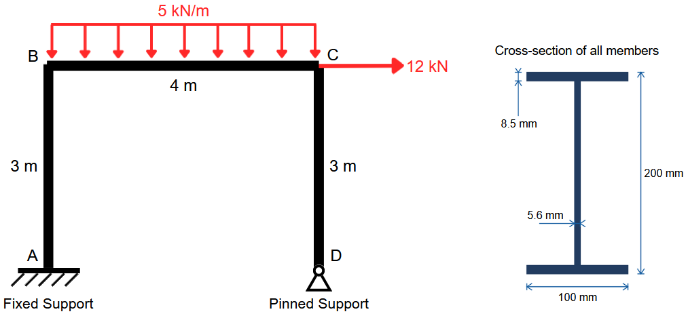

*Figure 1: Portal frame geometry, dimensions, supports, and applied loads*

The frame consists of two vertical members connected by a horizontal member.

The applied loads are:

* A horizontal point load of $12\ \mathrm{kN}$ at point $C$
* A uniformly distributed load of $5\ \mathrm{kN/m}$ acting on the horizontal member

The left bottom node is fixed, while the right bottom node is restrained in both the horizontal and vertical directions.

The material and cross-section properties used in the analysis are:

$$
E = 2\times10^{11}\ \mathrm{Pa}
$$

$$
I = 1.8456\times10^{-5}\ \mathrm{m^4}
$$

The same geometry, material properties, boundary conditions, and loads are used for both the FEM and analytical solutions.

---

## 3. CAD Geometry

The geometry of the structure is imported from two separate DXF files:

* Beam/frame centerline geometry
* Beam cross-section geometry

The input DXF filename and material Young's modulus are currently defined directly in the main MATLAB script:

```matlab
E= 2e+11; % Young's Modulus in Pascal

%Reading .dxf file for beam centerline
[beam_centerline_array] = DXF_Parser_Beam('beam_centerline_validation_example.DXF',unit_convert);

%Reading .dxf file for crossection
[~, crossection_member_array_numbered] = DXF_Parser_Beam('crossection_validation_example.DXF',unit_convert);
```

After the CAD files are imported, the solver plots the imported geometries for visual inspection.

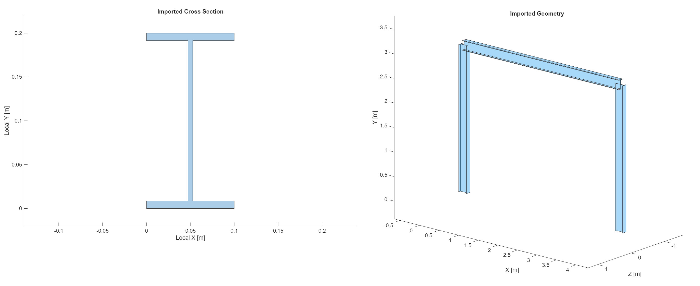

*Figure 2: Imported beam centerline and cross-section*

No additional user input is required at this stage.

The requirements for the DXF files and the CAD geometry import process are described in the [Module 2 Documentation](../Documentation/).

---

## 4. Meshing

After the CAD geometry is imported, the solver asks the user to specify the number of finite elements for each beam/frame member through the command window.

The current version of the solver uses same number of elements for each member.

The user enters the desired number of elements and presses `Enter` to continue.

The resulting finite element mesh is then displayed in Figure 3 in MATLAB.

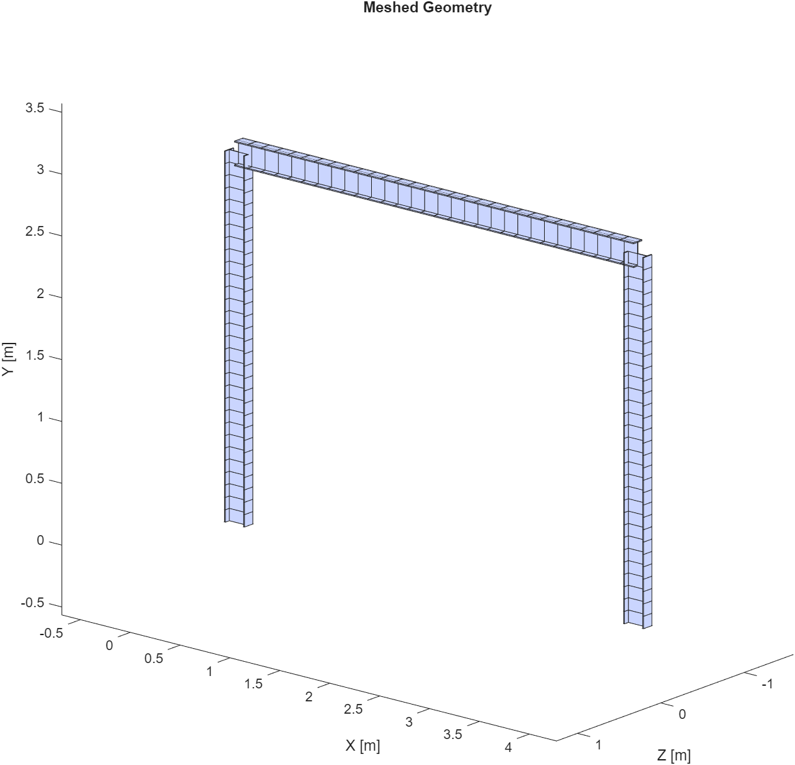

*Figure 3: Meshed portal frame*

The mesh shown in this example is the mesh used for the analysis presented below. 30 elements per frame member is used.

---

## 5. Boundary Conditions and Loads

Boundary conditions and external loads are applied interactively through the MATLAB command window and figure.

For this example, the following conditions are applied:

* A fixed support is applied at the left bottom node.
* A roller-X support and a roller-Y support are applied at the right bottom node.
* A horizontal force of $12\ \mathrm{kN}$ is applied at point $C$.
* No external moment is applied.
* A uniformly distributed load of $5\ \mathrm{kN/m}$ is applied vertically downward along the horizontal member.

After each boundary condition and load are entered, the solver displays the resulting model in Figure 4 in MATLAB.

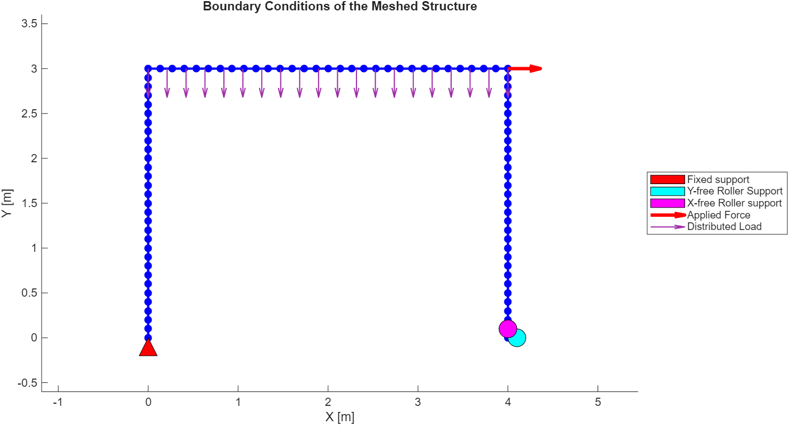

*Figure 4: Portal frame with applied boundary conditions and loads*

The detailed procedure for selecting nodes, supports, forces, moments, and distributed loads is described in the [Module 2 Documentation](../Documentation/).

---

## 6. Solver Results

After all inputs are defined, the solver assembles the global stiffness matrix and solves for the global nodal displacement vector.

The following results are obtained from the analysis.

### 6.1 Total Deformation

The total deformation of the structure is plotted.

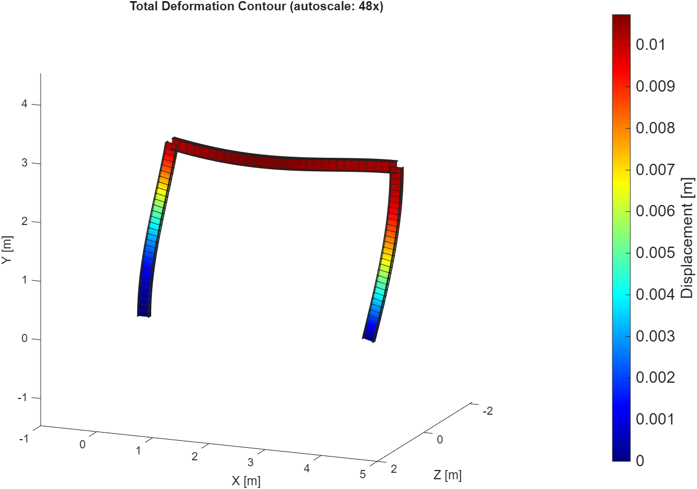

*Figure 5: Total deformation plot*

### 6.2 Bending Moment

The bending moment distribution is calculated for each beam/frame member and plotted.

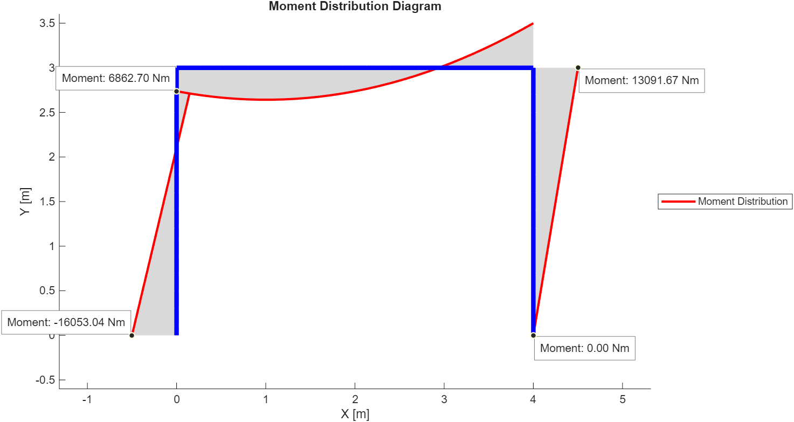

*Figure 6: Bending moment diagram*

### 6.3 Shear Force

The shear force distribution is calculated for each beam/frame member and plotted.

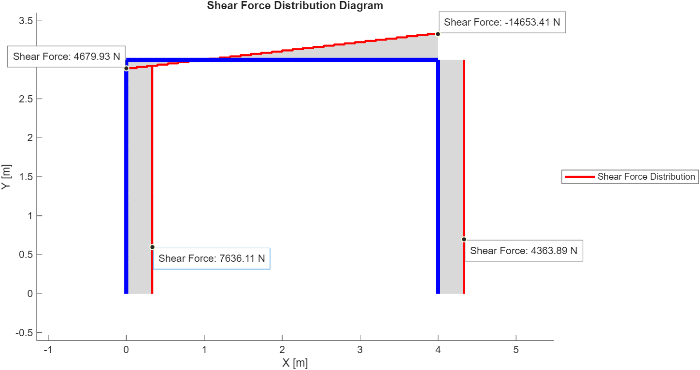

*Figure 7: Shear force diagram*

### 6.4 Axial Force

The axial force distribution is calculated for each beam/frame member and plotted.

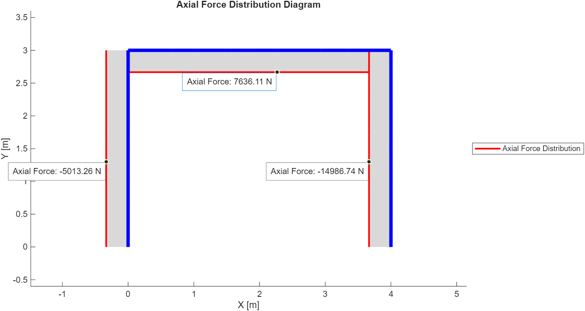

*Figure 8: Axial force diagram*

### 6.5 Support Reactions

The calculated support reactions are also reported by the solver.

| Reaction | MATLAB Result |
| -------- | ------------: |
| $R_{Ax}$ |             -7636.1 N |
| $R_{Ay}$ |             5013.3 N |
| $M_A$    |             16053 Nm |
| $R_{Dx}$ |             -4363.9 N |
| $R_{Dy}$ |             14987 N |
---

## 7. Validation

The FEM results are validated against an independent analytical solution.

The analytical solution is obtained using the force method and the unit-load method (virtual work method).

Since the structure is statically indeterminate to the second degree, the two reaction components at point D are selected as redundant forces.

The analytical solution is developed below step by step.

## 7.1 Reaction and Internal Forces

Since the structure is statically indeterminate to a degree of 2, the force method is used to determine the reaction forces at $D$.

The pinned support at $D$ is removed to obtain a statically determinate primary structure and then a virtual system is considered by applying unit reactions at $D$ in the horizontal and vertical directions as shown in the Figure below.

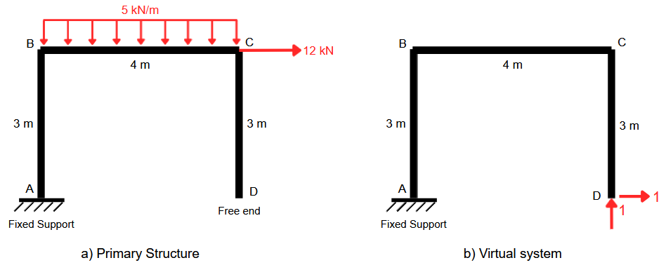

*Figure 9: Primary structure and Virtual system with unit reactions at $D$*

In the primary structure the point $D$ will have both vertical and horizontal displacements, $\Delta_{D,V}$ and $\Delta_{D,H}$. Ignoring the displacements produced by axial forces, these displacements can be calculated as:

$$
\Delta_{D,V}
=
\sum_i
\int
\frac{M_0M_{1,V}}{EI}\,dx
$$

and

$$
\Delta_{D,H}
=
\sum_i
\int
\frac{M_0M_{1,H}}{EI}\,dx
$$

where $M_0$ is the bending moment in the primary structure, $M_{1,V}$ is the bending moment on the virtual frame caused by the vertical unit load, and $M_{1,H}$ is the bending moment caused by the horizontal unit load.

Moreover, the compatibility equations for this case becomes:

$$
\Delta_{D,V}+f_{11}R_{Dy}+f_{12}R_{Dx}=0
\tag{1}
$$

$$
\Delta_{D,H}+f_{21}R_{Dy}+f_{22}R_{Dx}=0
\tag{2}
$$

where $R_{Dy}$ and $R_{Dx}$ are the redundant reaction forces at $D$ and $f_{11}$, $f_{12}$, $f_{21}$, and $f_{22}$ are  the flexibility coefficients which can be expressed as:

$$
f_{11}
=
\sum_i
\int
\frac{M_{1,V}^2}{EI}\,dx
$$

$$
f_{12}=f_{21}
=
\sum_i
\int
\frac{M_{1,H}M_{1,V}}{EI}\,dx
$$

$$
f_{22}
=
\sum_i
\int
\frac{M_{1,H}^2}{EI}\,dx
$$

Now that the equations are defined, we shall move on to defining expressions for bending moments of each frame member using the Figures 10 and 11 given below.

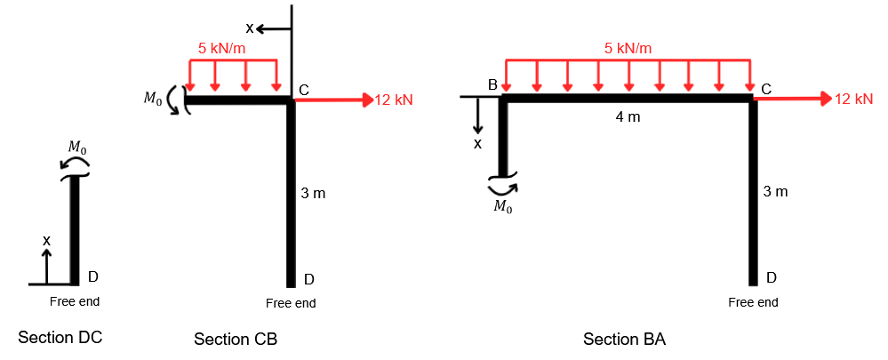

*Figure 10: Sections of primary structure*

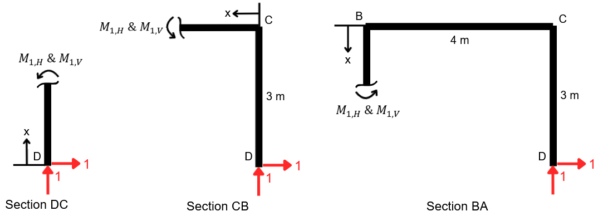

*Figure 11: Sections of virtual structure with unit reaction forces*

Noting that the bending moment is taken as positive when it causes tension outside the frame, the moments are found as follows:

For section $DC$:

$$
M_0= \ \ 0
$$

$$
M_{1,H}= \ \ -x
$$

$$
M_{1,V}= \ \ 0
$$

For section $CB$:

$$
M_0= \ \ 5\frac{x^2}{2}
$$

$$
M_{1,H}= \ \ -3
$$

$$
M_{1,V}= \ \ -x
$$

For section $BA$:

$$
M_0=5(4)(2)+12x = \ \ 12x+40
$$

$$
M_{1,H}= \ \ x-3
$$

$$
M_{1,V}= \ \ -4
$$

Using the moment expressions above:

$$
\Delta_{D,V}
=
\frac{1}{EI}
\left[
\int_0^4
\left(\frac{5x^2}{2}\right)(-x)\,dx
+
\int_0^3
(12x+40)(-4)\,dx
\right]
$$

$$
\Delta_{D,V}
=
 \ \ \frac{-856}{EI}
$$

Similarly,

$$
\Delta_{D,H}
=
\frac{1}{EI}
\left[
\int_0^4
\left(\frac{5x^2}{2}\right)(x-3)\,dx
+
\int_0^3
(12x+40)(x-3)\,dx
\right]
$$

$$
\Delta_{D,H}
=
 \ \ \frac{-394}{EI}
$$

The flexibility coefficient $f_{11}$ is:

$$
f_{11}
=
\frac{1}{EI}
\left[
\int_0^4(-x)^2\,dx
+
\int_0^3(-4)^2\,dx
\right]
$$

$$
f_{11}
=
 \ \ \frac{69.3333}{EI}
$$

The coupling coefficients are:

$$
f_{12}=f_{21}
=
\frac{1}{EI}
\left[
\int_0^4(-3)(-x)\,dx
+
\int_0^3(x-3)(-4)\,dx
\right]
$$

$$
f_{12}=f_{21}
=
 \ \ \frac{42}{EI}
$$

Finally,

$$
f_{22}
=
\frac{1}{EI}
\left[
\int_0^3(-x)^2\,dx
+
\int_0^4(-3)^2\,dx
+
\int_0^3(x-3)^2\,dx
\right]
$$

$$
f_{22}
=
 \ \ \frac{54}{EI}
$$

Substituting these results into Eqs. (1) and (2):

$$
-\frac{856}{EI}
+
\frac{69.3333}{EI}R_{Dy}
+
\frac{42}{EI}R_{Dx}
= \ \ 0
$$

$$
-\frac{394}{EI}
+
\frac{42}{EI}R_{Dy}
+
\frac{54}{EI}R_{Dx}
= \ \ 0
$$

Solving for the unknown redundant reactions gives:

$$
R_{Dx}= \ \ -4.3610\ \mathrm{kN}
 \ \ \qquad\text{(left)}
$$

$$
R_{Dy}= \ \ 14.9879\ \mathrm{kN}
 \ \ \qquad\text{(up)}
$$

Now, using static equilibrium on the original structure, the reactions at $A$ are found as follows:

Horizontal equilibrium:

$$
\sum F_x=0
$$

$$
R_{Ax}+12-(4.3610)=0
$$

$$
R_{Ax}= \ \ -7.6390\ \mathrm{kN}
 \ \ \qquad\text{(left)}
$$

Vertical equilibrium:

$$
\sum F_y=0
$$

$$
R_{Ay}-5(4)+14.9879=0
$$

$$
R_{Ay}= \ \ 5.0121\ \mathrm{kN}
 \ \ \qquad\text{(up)}
$$

Moment equilibrium about A:

$$
\sum M_A=0
$$

$$
R_{AM}-12(3)+14.9879(4)-5(4)(2)=0
$$

$$
R_{AM}= \ \ 16.0484\ \mathrm{kN\,m}
 \ \ \qquad\text{(clockwise)}
$$

Now that all reaction forces are known, we can determine the internal forces of the 
real structure and draw the moment, shear, and axial force diagrams. For this purpose, 
the structural sections are shown in the figure below.

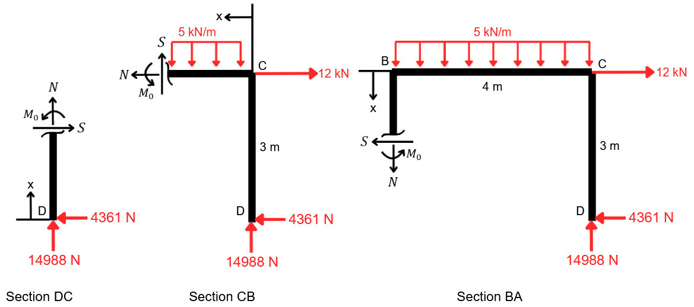

*Figure 12: Sections of the real structure*

For section $DC$:

$$
M= \ \ 4361x\ \mathrm{N\,m}
$$

$$
S=\ \ 4361\ \mathrm{N}
$$

$$
N= \ \ -14987.9\ \mathrm{N}
$$

For section $CB$:

$$
M = 5000\frac{x^2}{2} - (14987.9)x + 4361(3)
= \ \ 2500x^2-14987.9x+13083  \ \mathrm{N\,m}
$$

$$
S= \ \ 5000x-14987.9\ \mathrm{N}
$$

$$
N= \ \ 12000-4361= \ \ 7639\ \mathrm{N}
$$

For section $BA$:

$$
M = 5000(4)(2) + 12000x -(14987.9)(4) + 4361(3-x)
= \ \ 7639x-6868.6\ \mathrm{N\,m}
$$

$$
S=12000-4361= \ \ 7639\ \mathrm{N}
$$

$$
N= 14987.9-5000(4)= \ \ -5012.1\ \mathrm{N}
$$

---

## 7.2 Horizontal Displacement at C

The horizontal displacement at $C$ is calculated and compared with MATLAB results to validate the nodal displacements.

For this displacement calculation virtual work method is used. As shown in Figure 13, a unit horizontal load is applied at point C while the original external loads are removed.

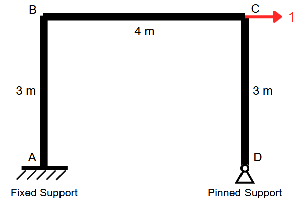

*Figure 13: Virtual structure with a unit horizontal load at $C$*


Neglecting axial contributions, the horizontal displacement at $C$ can be found from:

$$
\delta_{C,x}
=
\sum_i
\int_{L_i}
\frac{M(x)m(x)}{EI}\,dx
\tag{3}
$$

where $M(x)$ is the moment distribution of the real structure and $m(x)$ is the moment distribution of the virtual structure.

To obtain $m(x)$, the reaction forces of the virtual structure must be found. However, since the virtual structure is also indeterminate to the second degree, the same force method procedure must be used again to find the reactions of the virtual structure at point $D$.

Moreover, the flexibility matrix found in the previous calculations is exactly the same here. Therefore, only the horizontal and vertical displacements of the primary virtual structure at point $D$ are required.

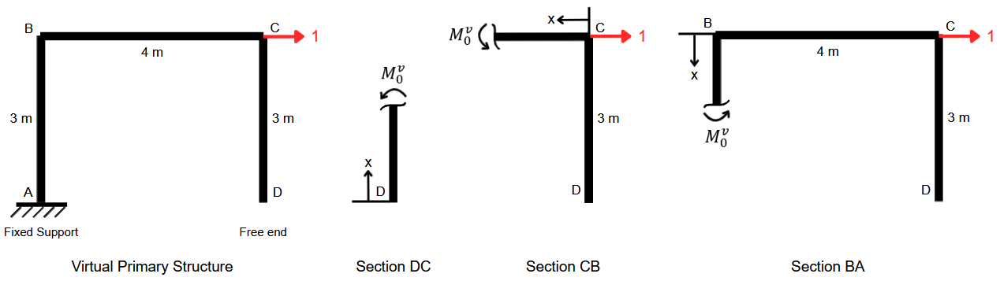

*Figure 14: Primary virtual structure and its sections*

Similarly to the previous section, the displacements are found from:

$$
\Delta^{v}_{D,V} =
\sum_i
\int_{L_i}
\frac{M^{v}_0M_{1,V}}{EI}\,dx
$$

and

$$
\Delta^{v}_{D,H} =
\sum_i
\int_{L_i}
\frac{M^{v}_0M_{1,H}}{EI}\,dx
$$

where $M^{v}_0$ is the bending moment of the primary virtual structure and the rest are the same as before.

By using Figure 14, the bending moments are calculated as follows:

For section $DC$:

$$
M^{v}_0= \ \ 0
$$

$$
M_{1,H}= \ \ -x
$$

$$
M_{1,V}= \ \ 0
$$

For section $CB$:

$$
M^{v}_0= \ \ 0
$$

$$
M_{1,H}= \ \ -3
$$

$$
M_{1,V}= \ \ -x
$$

For section $BA$:

$$
M^{v}_0= \ \ x
$$

$$
M_{1,H \ \ x-3
$$

$$
M_{1,V}= \ \ -4
$$

Hence,

$$
\Delta^{v}_{D,V}
=
\int_0^3
\frac{x(-4)}{EI}\,dx
=
 \ \ \frac{-18}{EI}
$$

and

$$
\Delta^{v}_{D,H}
=
\int_0^3
\frac{x(x-3)}{EI}\,dx
=
 \ \ \frac{-4.5}{EI}
$$

Substituting these into Eqs. (1) and (2):

$$
-\frac{18}{EI}
+
\frac{69.3333}{EI}R'_{Dy}
+
\frac{42}{EI}R'_{Dx}
= \ \ 0
$$

$$
-\frac{4.5}{EI}
+
\frac{42}{EI}R'_{Dy}
+
\frac{54}{EI}R'_{Dx}
= \ \ 0
$$

Solving for the unknown reactions gives:

$$
R'_{Dy}= \ \ 0.3955
\qquad\text{(up)}
$$

$$
R'_{Dx}= \ \ -0.2242
\qquad\text{(left)}
$$


Now that the reactions of the virtual system are known, its bending moment distribution $m(x)$ can be obtained by using the following figure.

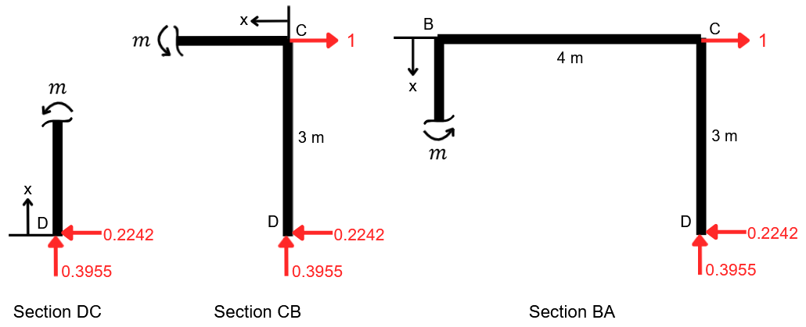

*Figure 15: Virtual structure sections*

For section $DC$:

$$
m= \ \ 0.2242x
$$

For section $CB$:

$$
m=(0.2242)(3)-0.3955x = \ \ 0.6726-0.3955x
$$


For section $BA$:

$$
m = 1.x + 0.2242(3-x) - (0.3955)(4) = \ \ 0.7758x-0.9094
$$

Substituting the real and virtual moment distributions into Eq. (3), the horizontal displacement at $C$ found as:

$$
\delta_{C,x}
=
\frac{1}{EI}
\left[
\int_0^3
(4361x)(0.2242x)\,dx
\right.
$$

$$
\left.
+
\int_0^4
(2500x^2-14987.9x+13083)
(0.6726-0.3955x)\,dx
\right.
$$

$$
\left.
+
\int_0^3
(7639x-6868.6)
(0.7758x-0.9094)\,dx
\right]
$$

Evaluating the three integrals:

$$
\delta_{C,x} =
\frac{1}{EI}
\left[
(8799.6258)
+
(12206.9072)
+
(16835.8912)
\right]
$$

$$
\delta_{C,x} =
0.010252\ \mathrm{m}
$$

or

$$
\boxed{
\delta_{C,x}=10.252\ \mathrm{mm}
}
$$

This value can be compared directly with the displacement obtained from the MATLAB finite element solver.


### 7.3 Comparing The Results

The analytical solution is compared with the FEM results obtained from the 2D Beam/Frame Solver.

#### Support Reactions

| Reaction | Analytical | FEM | Relative Error |
|---|---:|---:|---:|
| $R_{Ax}$ | $-7.6390$ kN | $-7.6361$ kN | 0.03796 % |
| $R_{Ay}$ | $5.0121$ kN | $5.0133$ kN | 0.02394 % |
| $M_A$ | $16.0484$ kN·m | $16.0530$ kN.m | 0.02866 % |
| $R_{Dx}$ | $-4.3610$ kN | $-4.3639$ kN | 0.06650 % |
| $R_{Dy}$ | $14.9879$ kN | $14.9867$ kN | 0.008006 % |

#### Nodal Displacement

| Quantity | Analytical | FEM | Relative Error |
|---|---:|---:|---:|
| Horizontal displacement at C | $10.252$ mm | $10.317$ mm | 0.6340 % |

It should be noted that the analytical displacement is slightly lower because axial contributions were omitted in the analytical solution, whereas they are included in the FE model.

The relative error is calculated as:

$$
\text{Relative Error}
=
\frac{
|x_{\text{FEM}}-x_{\text{Analytical}}|
}{
|x_{\text{Analytical}}|
}
\times 100\%
$$

#### Bending Moment

The analytical and FEM bending moment distributions are compared in the figure below. Here, note that for elements evaluated in the opposite direction during hand calculations, the moment signs are reversed relative to the MATLAB results to have a direct comparison.

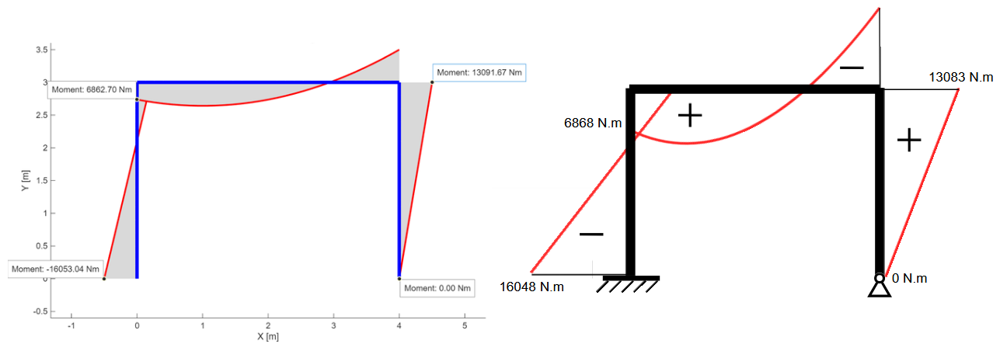

*Figure 16: Analytical vs. FEM bending moment diagram*

#### Shear Force

The analytical and FEM shear force distributions are compared in the figure below.

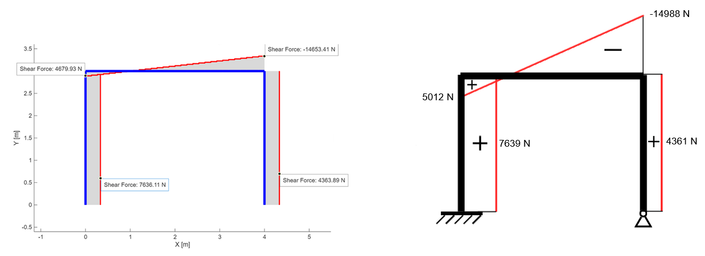

*Figure 17: Analytical vs. FEM shear force diagram*

#### Axial Force

The analytical and FEM axial force distributions are compared in the figure below.

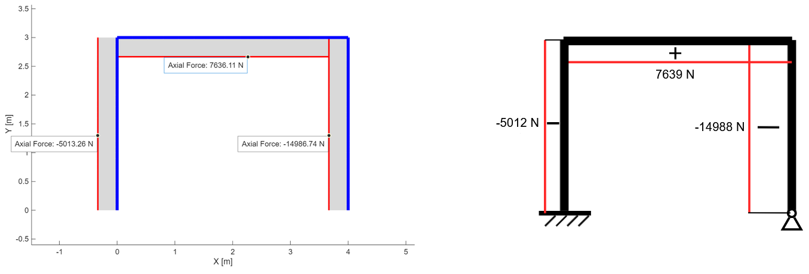

[Figure 18: Analytical vs. FEM axial force diagram*

The close agreement between the analytical and FEM results provides validation to the beam/frame 
solver.
